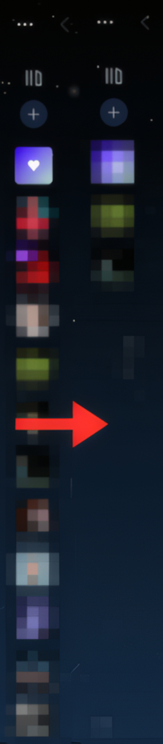

# Library Pin Collapsed

A [Spicetify](https://spicetify.app) extension that lets you choose which items appear in your library sidebar when it's collapsed.



## What it does

- When the sidebar is **collapsed**, only your pinned items are visible
- When the sidebar is **expanded**, everything shows normally
- Your pinned items are saved and persist across Spotify restarts

## Installation

1. Download `libraryPinCollapsed.js`
2. Copy it to your Spicetify extensions folder:
   - **Windows:** `%appdata%\spicetify\Extensions\`
   - **macOS/Linux:** `~/.config/spicetify/Extensions/`
3. Run:
```
spicetify config extensions libraryPinCollapsed.js
spicetify apply
```

## Usage

1. Expand your library sidebar
2. Right-click any item → **📌 Pin to collapsed view**
3. Collapse the sidebar — only pinned items will show
4. To unpin, right-click the item → **❌ Unpin from collapsed view**

## Notes
